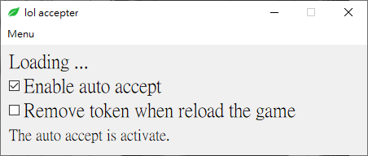

# lol-accepter

Simple plugins for accepting match while away from keyboard with League of Legends LCU.  

  

## Features
1. Auto accept any matches up.
2. No need to install.
3. Easy to hide and shows, user friendly.
4. For windows OS only currently.

## Download

You can download it from [Here](https://github.com/r48n34/lol-accepter/releases)

## Disclaimer
1. The plguins is builded with [lcu-driver](https://lcu-driver.readthedocs.io/en/latest/quickstart.html#websocket) ft. LCU API. No others third party libraries or plugin involved. Also, the plugin is base on local, no data will be sent out.

2. This plugin is compliant with [League Client API Policies](https://developer.riotgames.com/docs/lol#league-client) as it provides no gameplay advantage. You will not to be banned from using this tools in general.

## License
Distributed under the `MIT License`.