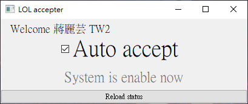

# lol-accepter

Simple plugins for accepting match while away from keyboard with League of Legends LCU.  

  

## Features
1. Auto accept any matches up.
2. No need to install.

## Download

You can download it from [Here](https://github.com/r48n34/lol-accepter/releases)

## Disclaimer
1. The plguins is builded with [league-connect](https://www.npmjs.com/package/league-connect) ft. LCU API. No others third party libraries or plugin involved. Also, the plugin is base on local, no data will be sent out.

2. This plugin is compliant with [League Client API Policies](https://developer.riotgames.com/docs/lol#league-client) as it provides no gameplay advantage. You will not to be banned from using this tools in general.

## Technology
This will build the distributable using `@nodegui/packer` based on your template. The output of the command is found under the build directory. You should gitignore the build directory.

More details about packer can be found here: https://github.com/nodegui/packer

## License
Distributed under the `MIT License`.
